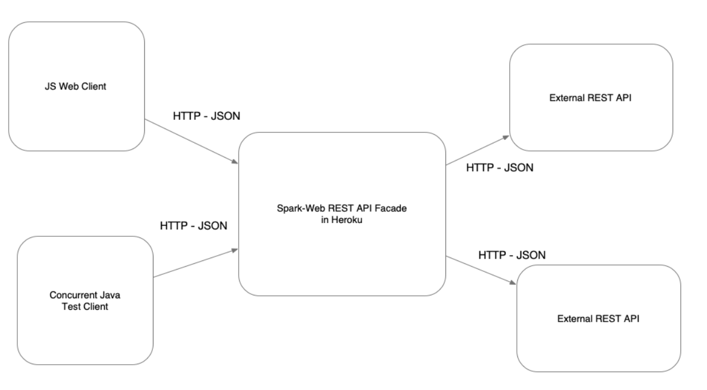
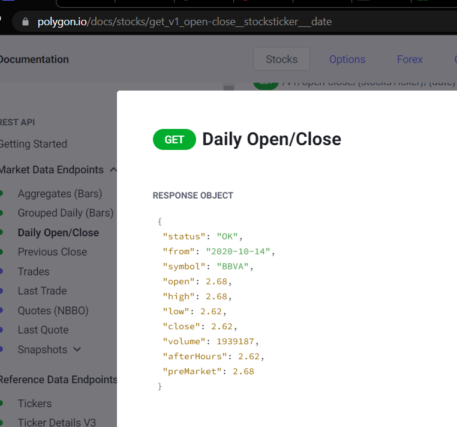

# Proyecto para consultar acciones

### Autor: Francisco Javier Rojas M
### Escuela Colombiana de Ingeniería Julio Garavito
### AREP G1
### Fecha: 18 de Agosto de 2022

## PROYECTO:
Esta aplicacion consta de una funcionalidad en la cual se pueda visualizar las acciones del mercado valores esto soportado en
una arquitectura que es el enfoque de la aplicacion de este proyecto, por esto se  debe dar solucion al problema.

#### PROBLEMA:
Usted debe construir una aplicación para consultar el mercado de valores de las acciones negociadas en Bolsa.
La aplicación recibirá el identificador de una acción, por ejemplo “MSFT” para Microsoft y deberá mostrar el histórico
de la valoración intra-día, diaria, semanal y mensual.

## Iniciando

puede clonar y alistar el repo con el siguiente comando

```
  git clone https://github.com/javier32rojas040506/LAB1-AREP.git
```
### Prerequisites

What things you need to install the software and how to install them

```
Give examples
```

### Installing

A step by step series of examples that tell you how to get a development env running

Say what the step will be

```
Give the example
```

And repeat

```
until finished
```

End with an example of getting some data out of the system or using it for a little demo

## Running the tests

Explain how to run the automated tests for this system

### Break down into end to end tests

Explain what these tests test and why

```
Give an example
```

### And coding style tests

Explain what these tests test and why

```
Give an example
```

## Deployment

Add additional notes about how to deploy this on a live system

## Built With

* [Dropwizard](http://www.dropwizard.io/1.0.2/docs/) - The web framework used
* [Maven](https://maven.apache.org/) - Dependency Management
* [ROME](https://rometools.github.io/rome/) - Used to generate RSS Feeds

## Contributing

Please read [CONTRIBUTING.md](https://gist.github.com/PurpleBooth/b24679402957c63ec426) for details on our code of conduct, and the process for submitting pull requests to us.

## Versioning

We use [SemVer](http://semver.org/) for versioning. For the versions available, see the [tags on this repository](https://github.com/your/project/tags).

## Authors

* **Billie Thompson** - *Initial work* - [PurpleBooth](https://github.com/PurpleBooth)

See also the list of [contributors](https://github.com/your/project/contributors) who participated in this project.

## License

This project is licensed under the MIT License - see the [LICENSE.md](LICENSE.md) file for details

## Acknowledgments

* Hat tip to anyone whose code was used
* Inspiration
* etc




#### DESCRIPCIÓN  DE LA ARQUITECTURA:
##### Requerimientos:
1) El cliente Web debe ser un cliente asíncrono que use servicios REST desplegados en Heroku y use Json como formato 
para los mensajes.
2) El servidor de Heroku servirá como un gateway para encapsular llamadas a otros servicios Web externos.
3) La aplicación debe ser multiusuario.
4) Todos los protocolos de comunicación serán sobre HTTP.
5) Los formatos de los mensajes de intercambio serán siempre JSON.
6) La interfaz gráfica del cliente debe ser los más limpia y agradable posible solo HTML y JS 
(Evite usar librerías complejas). Para invocar métodos REST desde el cliente usted puede utilizar la tecnología que 
desee.
7) Debe construir un cliente Java que permita probar las funciones del servidor fachada.
El cliente utiliza simples conexiones http para conectarse a los servicios. 
Este cliente debe hacer pruebas de concurrencia en su servidor de backend.
8) La fachada de servicios tendrá un caché que permitirá que llamados que ya se han realizado a las implementaciones
concretas con parámetros específicos no se realicen nuevamente. Puede almacenar el llamado como un String con su
respectiva respuesta, y comparar el string respectivo. Recuerde que el caché es una simple estructura de datos.
9) Se debe poder extender fácilmente, por ejemplo, es fácil agregar nuevas funcionalidades, o es fácil cambiar el
proveedor de una funcionalidad.
10) Debe utilizar maven para gestionar el ciclo de vida, git y github para almacenar al código fuente y heroku como 
plataforma de producción.

#### EXPONIENDO LA ARQUITECTURA
- ##### Spark web REST API Facade in Heroku || SparkWebApp
  * ~~~
    primero tenemos la estructura: 
    ~~~
    

  * ~~~
    en la siguinete imagen se muestra como el contentType es JSON
    ~~~
    

  * ~~~
    es la clase que atiende y los endpoints
    ~~~
    
  
  * ~~~
    podemos agregar todas las APIs en este  lugar,
    es importante agregar el query param name en 
    donde va el name stock de la api a consultar
    ~~~
    
  * ~~~
    aqui se definen los metodos
    ~~~
    
  
  ##### JS WEB client
  * ~~~
    El servidor usa fetch para traer la informacion via Json
    ~~~
    
  ##### EXTERNAL APIs
  * ~~~
       External APIs are
     ~~~
     
     

#### EXTENSIBILIDAD:
La aplicación fue diseñada de manera que se pueda agregar nuevos componentes sin afectar los anteriores, principio Open
Close.

##### Ejemplo de nuevo componente
* ~~~
    podemos agregar todas las APIs en este  lugar,
    es importante agregar el query param name en donde
    va el name stock de la api a consultar:
  
    private static final String API_URL_ORIGINAL = "https://api.stock/IBM";
    POR
    private static final String API_URL_ORIGINAL = "https://api.stock/name";
  ~~~
    

* ~~~
    definir metodo con el verbo correspondiente y el endpoint
    HTTP-VERB("/EndpoitName", "application/json",
                (request, response) -> {
                    String name = request.queryParams("name");
                    return ActionsStock.getStockByName(name, API_URL_2, JSON_KEY);
        });
    
   -> name name of the Stock to search
   -> GET_URL address of the API to search
   -> JSON_KEY json key to identify data an extract it
    
    
  EXAMPLE OF JSON_KEY
    DATA:{
        DATA2:{
          NAME:NOMBRE
          age:21
         }
    }
  JSON_KEY FROM THE PREVIUS JSON IS DATA
    
  ~~~
  
  
  ~~~
    probar en postman
  ~~~
  
  
  ~~~
    ahora puede mapearlo al gusto en el html de la aplicacion o incluso incorporrarlo a
  su propia API
  ~~~